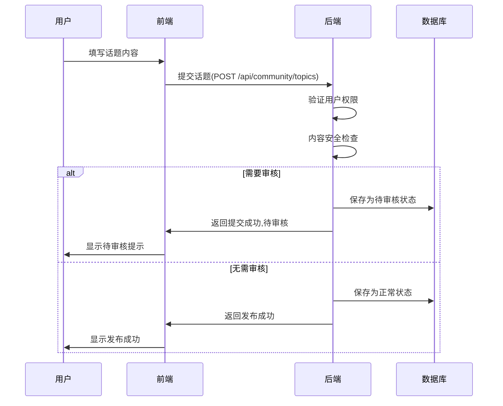
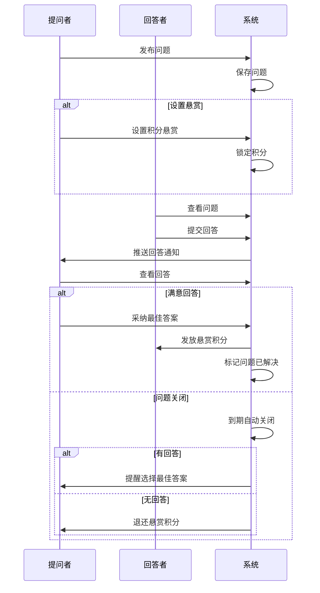
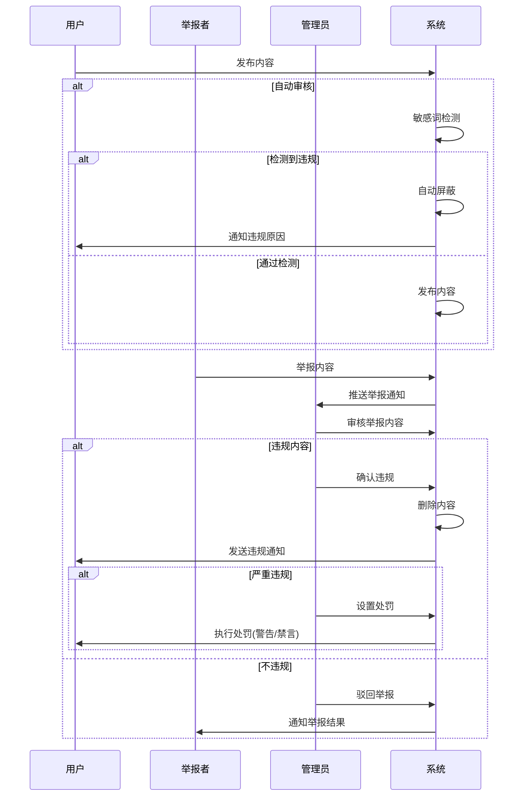
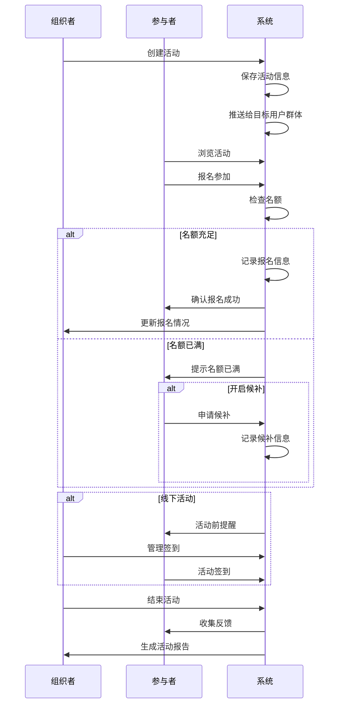

# 校企联盟平台 - 在线交流社区功能设计

## 一、功能概述

在线交流社区作为校企联盟平台的重要组成部分，旨在为学校、企业和学生提供一个开放的交流环境，促进知识分享、经验交流和资源对接。该功能模块将支持话题讨论、问答互动、资源共享等多种交流形式，打破信息壁垒，加强校企之间的沟通与合作。

## 二、核心功能设计

### 1. 社区板块管理

- **板块分类**：按照不同主题划分板块，如校企合作、技术交流、就业指导、项目对接等
- **板块权限**：不同板块可设置不同的访问权限，如公开板块、企业专区、学校专区等
- **置顶与精华**：支持重要话题置顶和优质内容精华标记功能

### 2. 话题与帖子

- **话题发布**：用户可在相应板块发布话题讨论
- **内容编辑**：支持富文本编辑，包括文字、图片、视频、附件等多媒体内容
- **互动功能**：评论、回复、点赞、收藏、分享等社交互动功能
- **标签系统**：话题可添加标签，便于分类和检索

### 3. 问答系统

- **提问功能**：用户可提出专业问题，寻求解答
- **回答功能**：其他用户可针对问题提供回答和建议
- **最佳答案**：提问者可将最有价值的回答标记为"最佳答案"
- **悬赏机制**：可设置积分悬赏，鼓励高质量回答

### 4. 资源共享

- **资源上传**：分享学习资料、技术文档、案例分析等资源
- **资源评价**：用户可对共享资源进行评分和评价
- **资源分类**：按专业领域、用途等进行分类管理

### 5. 活动发布与报名

- **线上活动**：发布线上讲座、研讨会等活动信息
- **线下活动**：发布校企交流会、招聘会等线下活动
- **报名管理**：活动报名、签到、反馈等全流程管理

### 6. 私信与通知

- **私信系统**：用户间的私密交流渠道
- **消息通知**：互动提醒、系统通知等消息管理
- **订阅功能**：关注特定话题、用户或板块的更新

### 7. 积分与激励

- **积分规则**：参与讨论、分享资源等行为获取积分
- **等级体系**：基于积分和贡献度的用户等级划分
- **荣誉徽章**：优质贡献者可获得特殊徽章标识

### 8. 内容审核与举报

- **自动审核**：敏感词过滤、垃圾内容识别等
- **人工审核**：对举报内容进行人工复核
- **违规处理**：对违规用户实施警告、禁言等措施

## 三、角色权限设计

### 1. 系统管理员

- 管理所有社区板块、话题和用户
- 设置全局规则和权限配置
- 处理举报和投诉
- 查看系统数据统计和分析

### 2. 学校管理员

- 管理学校相关板块内容
- 审核本校师生发布的内容
- 发布学校相关通知和活动
- 查看学校相关数据统计

### 3. 企业管理员

- 管理企业相关板块内容
- 审核企业成员发布的内容
- 发布企业相关通知和活动
- 查看企业相关数据统计

### 4. 教师

- 发布专业知识和教学资源
- 回答学生问题和提供指导
- 组织线上教学活动和讨论
- 评价学生参与度和表现

### 5. 企业导师

- 分享行业经验和实践案例
- 回答专业技术问题
- 发布企业实习和项目机会
- 与潜在人才进行交流

### 6. 学生

- 参与话题讨论和问答
- 分享学习心得和作品
- 获取就业指导和实习机会
- 与企业导师和同学交流

### 7. 游客

- 浏览公开板块内容
- 查看精华话题和热门讨论
- 注册成为正式用户

## 四、API接口设计

### 1. 板块管理接口

```
GET /api/community/categories - 获取所有板块分类
GET /api/community/categories/{categoryId} - 获取特定板块详情
POST /api/community/categories - 创建新板块(管理员权限)
PUT /api/community/categories/{categoryId} - 更新板块信息(管理员权限)
DELETE /api/community/categories/{categoryId} - 删除板块(管理员权限)
```

### 2. 话题管理接口

```
GET /api/community/topics - 获取话题列表(支持分页、筛选)
GET /api/community/topics/{topicId} - 获取话题详情
POST /api/community/topics - 创建新话题
PUT /api/community/topics/{topicId} - 更新话题内容(作者或管理员)
DELETE /api/community/topics/{topicId} - 删除话题(作者或管理员)
POST /api/community/topics/{topicId}/sticky - 置顶话题(管理员权限)
POST /api/community/topics/{topicId}/essence - 标记精华(管理员权限)
```

### 3. 评论与回复接口

```
GET /api/community/topics/{topicId}/comments - 获取话题评论
POST /api/community/topics/{topicId}/comments - 发表评论
PUT /api/community/comments/{commentId} - 更新评论
DELETE /api/community/comments/{commentId} - 删除评论
POST /api/community/comments/{commentId}/replies - 回复评论
```

### 4. 问答系统接口

```
GET /api/community/questions - 获取问题列表
GET /api/community/questions/{questionId} - 获取问题详情
POST /api/community/questions - 发布问题
PUT /api/community/questions/{questionId} - 更新问题
DELETE /api/community/questions/{questionId} - 删除问题
POST /api/community/questions/{questionId}/answers - 回答问题
PUT /api/community/answers/{answerId} - 更新回答
POST /api/community/answers/{answerId}/accept - 采纳最佳答案
```

### 5. 资源共享接口

```
GET /api/community/resources - 获取资源列表
GET /api/community/resources/{resourceId} - 获取资源详情
POST /api/community/resources - 上传资源
PUT /api/community/resources/{resourceId} - 更新资源信息
DELETE /api/community/resources/{resourceId} - 删除资源
POST /api/community/resources/{resourceId}/ratings - 评价资源
```

### 6. 活动管理接口

```
GET /api/community/events - 获取活动列表
GET /api/community/events/{eventId} - 获取活动详情
POST /api/community/events - 创建活动
PUT /api/community/events/{eventId} - 更新活动信息
DELETE /api/community/events/{eventId} - 删除活动
POST /api/community/events/{eventId}/signup - 活动报名
GET /api/community/events/{eventId}/participants - 获取报名人员
```

### 7. 用户互动接口

```
POST /api/community/topics/{topicId}/like - 点赞话题
POST /api/community/topics/{topicId}/favorite - 收藏话题
POST /api/community/topics/{topicId}/share - 分享话题
POST /api/community/users/{userId}/follow - 关注用户
GET /api/community/users/{userId}/followers - 获取粉丝列表
GET /api/community/users/{userId}/following - 获取关注列表
```

### 8. 消息通知接口

```
GET /api/community/messages - 获取私信列表
GET /api/community/messages/{conversationId} - 获取私信详情
POST /api/community/messages - 发送私信
GET /api/community/notifications - 获取通知列表
PUT /api/community/notifications/{notificationId}/read - 标记通知为已读
```

### 9. 内容审核接口

```
POST /api/community/reports - 举报内容
GET /api/community/reports - 获取举报列表(管理员)
PUT /api/community/reports/{reportId}/process - 处理举报(管理员)
POST /api/community/users/{userId}/ban - 禁言用户(管理员)
```

## 五、数据库设计

### 1. 板块表(community_category)
- id: 主键
- name: 板块名称
- description: 板块描述
- icon: 板块图标
- sort_order: 排序顺序
- parent_id: 父板块ID(用于子板块)
- permission_level: 权限级别
- created_at: 创建时间
- updated_at: 更新时间

### 2. 话题表(community_topic)
- id: 主键
- title: 话题标题
- content: 话题内容
- user_id: 发布用户ID
- category_id: 所属板块ID
- view_count: 浏览次数
- comment_count: 评论数量
- like_count: 点赞数量
- is_sticky: 是否置顶
- is_essence: 是否精华
- status: 状态(正常、待审核、已删除)
- created_at: 创建时间
- updated_at: 更新时间

### 3. 评论表(community_comment)
- id: 主键
- content: 评论内容
- user_id: 评论用户ID
- topic_id: 所属话题ID
- parent_id: 父评论ID(用于回复)
- like_count: 点赞数量
- status: 状态
- created_at: 创建时间
- updated_at: 更新时间

### 4. 问题表(community_question)
- id: 主键
- title: 问题标题
- content: 问题描述
- user_id: 提问用户ID
- category_id: 所属分类ID
- view_count: 浏览次数
- answer_count: 回答数量
- bounty_points: 悬赏积分
- best_answer_id: 最佳答案ID
- status: 状态(未解决、已解决、关闭)
- created_at: 创建时间
- updated_at: 更新时间

### 5. 回答表(community_answer)
- id: 主键
- content: 回答内容
- user_id: 回答用户ID
- question_id: 所属问题ID
- like_count: 点赞数量
- is_accepted: 是否被采纳
- created_at: 创建时间
- updated_at: 更新时间

### 6. 资源表(community_resource)
- id: 主键
- title: 资源标题
- description: 资源描述
- user_id: 上传用户ID
- category_id: 所属分类ID
- file_path: 文件路径
- file_size: 文件大小
- file_type: 文件类型
- download_count: 下载次数
- rating_avg: 平均评分
- rating_count: 评分人数
- status: 状态
- created_at: 创建时间
- updated_at: 更新时间

### 7. 活动表(community_event)
- id: 主键
- title: 活动标题
- description: 活动描述
- user_id: 发布用户ID
- organization_id: 组织ID
- event_type: 活动类型(线上/线下)
- start_time: 开始时间
- end_time: 结束时间
- location: 活动地点
- max_participants: 最大参与人数
- current_participants: 当前参与人数
- status: 活动状态
- created_at: 创建时间
- updated_at: 更新时间

### 8. 用户关系表(community_user_relation)
- id: 主键
- user_id: 用户ID
- target_id: 目标用户ID
- relation_type: 关系类型(关注/拉黑)
- created_at: 创建时间

### 9. 消息表(community_message)
- id: 主键
- sender_id: 发送者ID
- receiver_id: 接收者ID
- content: 消息内容
- is_read: 是否已读
- created_at: 创建时间

### 10. 通知表(community_notification)
- id: 主键
- user_id: 接收用户ID
- content: 通知内容
- notification_type: 通知类型
- related_id: 相关内容ID
- is_read: 是否已读
- created_at: 创建时间

### 11. 举报表(community_report)
- id: 主键
- reporter_id: 举报者ID
- content_type: 内容类型(话题/评论/问题/回答)
- content_id: 内容ID
- reason: 举报原因
- status: 处理状态
- handler_id: 处理人ID
- handle_time: 处理时间
- created_at: 创建时间

## 六、业务流程

### 1. 话题发布流程



### 2. 问答互动流程



### 3. 内容审核流程



### 4. 活动组织流程



## 七、安全与性能考虑

### 1. 安全措施

- **内容安全**：实施敏感词过滤、反垃圾内容机制
- **身份验证**：确保用户操作权限验证
- **数据保护**：防止SQL注入、XSS攻击等安全漏洞
- **隐私保护**：用户可设置内容可见范围和个人信息展示级别

### 2. 性能优化

- **缓存机制**：热门话题、活跃板块等内容采用缓存
- **分页加载**：长列表采用分页或无限滚动加载
- **延迟加载**：非关键资源延迟加载
- **数据库优化**：建立合适的索引，优化查询语句

### 3. 扩展性考虑

- **模块化设计**：便于功能扩展和定制
- **API版本控制**：支持API升级而不影响现有客户端
- **第三方集成**：预留与其他系统集成的接口

## 八、实施路线图

### 第一阶段：基础功能实现
- 板块管理
- 话题发布与评论
- 基本用户互动(点赞、收藏)

### 第二阶段：功能扩展
- 问答系统
- 资源共享
- 私信与通知

### 第三阶段：高级功能
- 活动管理
- 积分与激励体系
- 内容审核与举报

### 第四阶段：优化与集成
- 性能优化
- 移动端适配
- 与平台其他模块深度集成

## 九、实施计划

### 第一阶段：基础设施搭建（2周）

#### 1. 数据库设计与实现
- 创建社区相关数据表
- 设计表间关系
- 编写Flyway迁移脚本

#### 2. 基础框架搭建
- 创建实体类、DTO、VO
- 编写Mapper接口
- 实现基础Service层
- 配置安全权限

#### 3. 基本API实现
- 板块管理接口
- 话题管理接口
- 评论与回复接口

### 第二阶段：核心功能实现（3周）

#### 1. 话题与评论系统
- 话题发布、编辑、删除功能
- 评论与回复功能
- 点赞、收藏功能
- 标签系统

#### 2. 问答系统
- 问题发布与编辑
- 回答提交与管理
- 最佳答案采纳
- 悬赏机制

#### 3. 用户互动功能
- 用户关注
- 私信系统
- 通知中心

### 第三阶段：高级功能实现（2周）

#### 1. 资源共享系统
- 资源上传与管理
- 资源分类与检索
- 资源评价系统

#### 2. 活动管理系统
- 活动发布与管理
- 报名系统
- 活动反馈与评价

#### 3. 积分与激励系统
- 积分规则实现
- 等级体系
- 荣誉徽章

### 第四阶段：安全与审核（2周）

#### 1. 内容安全
- 敏感词过滤
- 内容自动审核
- 举报处理系统

#### 2. 权限管理
- 细粒度权限控制
- 内容可见性设置
- 用户权限管理

#### 3. 安全防护
- XSS防护
- CSRF防护
- 接口限流

### 第五阶段：优化与测试（1周）

#### 1. 性能优化
- 缓存机制
- 数据库查询优化
- 页面加载优化

#### 2. 测试与修复
- 功能测试
- 性能测试
- 安全测试
- 问题修复

### 第六阶段：集成与上线（1周）

#### 1. 与其他模块集成
- 与用户系统集成
- 与组织管理集成
- 与成果展示集成

#### 2. 文档与培训
- API文档完善
- 用户使用手册
- 管理员培训

#### 3. 上线部署
- 环境配置
- 数据迁移
- 灰度发布
- 监控配置

## 十、与现有系统集成

### 1. 用户系统集成

#### 用户身份与权限
- 复用现有用户体系，无需重复注册
- 基于现有角色（学生、教师、企业导师等）分配社区权限
- 利用Spring Security进行权限控制

#### 用户资料同步
- 用户头像、昵称等基本信息从主系统同步
- 社区特有信息（等级、积分等）独立存储
- 用户状态变更（如禁用）自动同步到社区系统

### 2. 组织管理集成

#### 组织与板块关联
- 学校、企业等组织可关联特定社区板块
- 组织管理员可管理关联板块内容
- 组织成员默认获得相应板块的访问权限

#### 组织活动同步
- 组织在主系统创建的活动可自动同步到社区活动模块
- 社区活动报名信息可回流到组织管理系统
- 提供API接口实现双向数据同步

### 3. 成果展示集成

#### 成果分享
- 学生可一键将个人成果分享到社区
- 社区话题可引用学生作品集、竞赛获奖等成果
- 成果浏览量、点赞数据可回流到成果展示系统

#### 成果讨论
- 为每个公开成果自动创建讨论区
- 成果讨论的精华内容可显示在成果展示页面
- 成果相关问答可提升成果的曝光度

### 4. 课程资源集成

#### 课程讨论区
- 为每门双师课堂自动创建专属讨论区
- 课程相关资源可在社区中分享和讨论
- 教师和企业导师可在讨论区发布通知和答疑

#### 学习社群
- 基于课程自动创建学习社群
- 课程结束后社群可持续存在，促进长期交流
- 优秀社群可升级为专业兴趣社区

### 5. 招聘与就业集成

#### 职业咨询
- 企业可在社区中开设职业咨询专区
- 学生可提问关于就业、职业发展的问题
- 问答内容可关联到招聘岗位信息

#### 内推与推荐
- 社区活跃用户可获得内推机会
- 企业可基于社区表现发现潜在人才
- 提供简历一键投递到招聘系统的功能

### 6. 技术实现方案

#### 数据集成
- 使用统一的用户ID和组织ID作为关联键
- 采用消息队列实现系统间的异步通信
- 提供REST API实现系统间的实时数据交换

#### 界面集成
- 在主系统导航栏添加社区入口
- 各功能模块页面添加相关社区讨论的快捷入口
- 统一的设计风格和用户体验

#### 权限集成
- 统一的认证中心(OAuth2)
- 基于JWT的无状态认证
- 细粒度的功能权限控制

## 十一、数据库迁移脚本示例

以下是实现在线交流社区功能所需的Flyway数据库迁移脚本示例：

### 1. 创建社区板块表

```sql
-- V1.10.0__create_community_tables.sql
-- 创建社区板块表
CREATE TABLE community_category (
    id BIGINT AUTO_INCREMENT PRIMARY KEY,
    name VARCHAR(100) NOT NULL COMMENT '板块名称',
    description TEXT COMMENT '板块描述',
    icon VARCHAR(255) COMMENT '板块图标',
    sort_order INT DEFAULT 0 COMMENT '排序顺序',
    parent_id BIGINT COMMENT '父板块ID',
    permission_level INT DEFAULT 0 COMMENT '权限级别：0-公开，1-登录可见，2-组织成员可见，3-管理员可见',
    created_at TIMESTAMP DEFAULT CURRENT_TIMESTAMP COMMENT '创建时间',
    updated_at TIMESTAMP DEFAULT CURRENT_TIMESTAMP ON UPDATE CURRENT_TIMESTAMP COMMENT '更新时间',
    FOREIGN KEY (parent_id) REFERENCES community_category(id) ON DELETE SET NULL
) COMMENT '社区板块表';

-- 创建话题表
CREATE TABLE community_topic (
    id BIGINT AUTO_INCREMENT PRIMARY KEY,
    title VARCHAR(200) NOT NULL COMMENT '话题标题',
    content TEXT COMMENT '话题内容',
    user_id BIGINT NOT NULL COMMENT '发布用户ID',
    category_id BIGINT NOT NULL COMMENT '所属板块ID',
    view_count INT DEFAULT 0 COMMENT '浏览次数',
    comment_count INT DEFAULT 0 COMMENT '评论数量',
    like_count INT DEFAULT 0 COMMENT '点赞数量',
    is_sticky TINYINT(1) DEFAULT 0 COMMENT '是否置顶',
    is_essence TINYINT(1) DEFAULT 0 COMMENT '是否精华',
    status VARCHAR(20) DEFAULT 'NORMAL' COMMENT '状态：NORMAL-正常，PENDING-待审核，DELETED-已删除',
    created_at TIMESTAMP DEFAULT CURRENT_TIMESTAMP COMMENT '创建时间',
    updated_at TIMESTAMP DEFAULT CURRENT_TIMESTAMP ON UPDATE CURRENT_TIMESTAMP COMMENT '更新时间',
    FOREIGN KEY (user_id) REFERENCES users(id) ON DELETE CASCADE,
    FOREIGN KEY (category_id) REFERENCES community_category(id) ON DELETE CASCADE
) COMMENT '社区话题表';

-- 创建评论表
CREATE TABLE community_comment (
    id BIGINT AUTO_INCREMENT PRIMARY KEY,
    content TEXT NOT NULL COMMENT '评论内容',
    user_id BIGINT NOT NULL COMMENT '评论用户ID',
    topic_id BIGINT NOT NULL COMMENT '所属话题ID',
    parent_id BIGINT COMMENT '父评论ID',
    like_count INT DEFAULT 0 COMMENT '点赞数量',
    status VARCHAR(20) DEFAULT 'NORMAL' COMMENT '状态：NORMAL-正常，DELETED-已删除',
    created_at TIMESTAMP DEFAULT CURRENT_TIMESTAMP COMMENT '创建时间',
    updated_at TIMESTAMP DEFAULT CURRENT_TIMESTAMP ON UPDATE CURRENT_TIMESTAMP COMMENT '更新时间',
    FOREIGN KEY (user_id) REFERENCES users(id) ON DELETE CASCADE,
    FOREIGN KEY (topic_id) REFERENCES community_topic(id) ON DELETE CASCADE,
    FOREIGN KEY (parent_id) REFERENCES community_comment(id) ON DELETE SET NULL
) COMMENT '社区评论表';
```

### 2. 创建问答系统表

```sql
-- V1.10.1__create_community_qa_tables.sql
-- 创建问题表
CREATE TABLE community_question (
    id BIGINT AUTO_INCREMENT PRIMARY KEY,
    title VARCHAR(200) NOT NULL COMMENT '问题标题',
    content TEXT COMMENT '问题描述',
    user_id BIGINT NOT NULL COMMENT '提问用户ID',
    category_id BIGINT NOT NULL COMMENT '所属分类ID',
    view_count INT DEFAULT 0 COMMENT '浏览次数',
    answer_count INT DEFAULT 0 COMMENT '回答数量',
    bounty_points INT DEFAULT 0 COMMENT '悬赏积分',
    best_answer_id BIGINT COMMENT '最佳答案ID',
    status VARCHAR(20) DEFAULT 'UNSOLVED' COMMENT '状态：UNSOLVED-未解决，SOLVED-已解决，CLOSED-已关闭',
    created_at TIMESTAMP DEFAULT CURRENT_TIMESTAMP COMMENT '创建时间',
    updated_at TIMESTAMP DEFAULT CURRENT_TIMESTAMP ON UPDATE CURRENT_TIMESTAMP COMMENT '更新时间',
    FOREIGN KEY (user_id) REFERENCES users(id) ON DELETE CASCADE,
    FOREIGN KEY (category_id) REFERENCES community_category(id) ON DELETE CASCADE
) COMMENT '社区问题表';

-- 创建回答表
CREATE TABLE community_answer (
    id BIGINT AUTO_INCREMENT PRIMARY KEY,
    content TEXT NOT NULL COMMENT '回答内容',
    user_id BIGINT NOT NULL COMMENT '回答用户ID',
    question_id BIGINT NOT NULL COMMENT '所属问题ID',
    like_count INT DEFAULT 0 COMMENT '点赞数量',
    is_accepted TINYINT(1) DEFAULT 0 COMMENT '是否被采纳',
    created_at TIMESTAMP DEFAULT CURRENT_TIMESTAMP COMMENT '创建时间',
    updated_at TIMESTAMP DEFAULT CURRENT_TIMESTAMP ON UPDATE CURRENT_TIMESTAMP COMMENT '更新时间',
    FOREIGN KEY (user_id) REFERENCES users(id) ON DELETE CASCADE,
    FOREIGN KEY (question_id) REFERENCES community_question(id) ON DELETE CASCADE
) COMMENT '社区回答表';

-- 添加外键约束
ALTER TABLE community_question 
ADD CONSTRAINT fk_question_best_answer 
FOREIGN KEY (best_answer_id) REFERENCES community_answer(id) ON DELETE SET NULL;
```

### 3. 创建用户互动表

```sql
-- V1.10.2__create_community_interaction_tables.sql
-- 创建用户关系表
CREATE TABLE community_user_relation (
    id BIGINT AUTO_INCREMENT PRIMARY KEY,
    user_id BIGINT NOT NULL COMMENT '用户ID',
    target_id BIGINT NOT NULL COMMENT '目标用户ID',
    relation_type VARCHAR(20) NOT NULL COMMENT '关系类型：FOLLOW-关注，BLOCK-拉黑',
    created_at TIMESTAMP DEFAULT CURRENT_TIMESTAMP COMMENT '创建时间',
    FOREIGN KEY (user_id) REFERENCES users(id) ON DELETE CASCADE,
    FOREIGN KEY (target_id) REFERENCES users(id) ON DELETE CASCADE,
    UNIQUE KEY uk_user_target_relation (user_id, target_id, relation_type)
) COMMENT '用户关系表';

-- 创建消息表
CREATE TABLE community_message (
    id BIGINT AUTO_INCREMENT PRIMARY KEY,
    sender_id BIGINT NOT NULL COMMENT '发送者ID',
    receiver_id BIGINT NOT NULL COMMENT '接收者ID',
    content TEXT NOT NULL COMMENT '消息内容',
    is_read TINYINT(1) DEFAULT 0 COMMENT '是否已读',
    created_at TIMESTAMP DEFAULT CURRENT_TIMESTAMP COMMENT '创建时间',
    FOREIGN KEY (sender_id) REFERENCES users(id) ON DELETE CASCADE,
    FOREIGN KEY (receiver_id) REFERENCES users(id) ON DELETE CASCADE
) COMMENT '私信表';

-- 创建通知表
CREATE TABLE community_notification (
    id BIGINT AUTO_INCREMENT PRIMARY KEY,
    user_id BIGINT NOT NULL COMMENT '接收用户ID',
    content TEXT NOT NULL COMMENT '通知内容',
    notification_type VARCHAR(50) NOT NULL COMMENT '通知类型：COMMENT-评论，LIKE-点赞，FOLLOW-关注，SYSTEM-系统',
    related_id BIGINT COMMENT '相关内容ID',
    is_read TINYINT(1) DEFAULT 0 COMMENT '是否已读',
    created_at TIMESTAMP DEFAULT CURRENT_TIMESTAMP COMMENT '创建时间',
    FOREIGN KEY (user_id) REFERENCES users(id) ON DELETE CASCADE
) COMMENT '通知表';

-- 创建点赞表
CREATE TABLE community_like (
    id BIGINT AUTO_INCREMENT PRIMARY KEY,
    user_id BIGINT NOT NULL COMMENT '用户ID',
    content_type VARCHAR(20) NOT NULL COMMENT '内容类型：TOPIC-话题，COMMENT-评论，QUESTION-问题，ANSWER-回答',
    content_id BIGINT NOT NULL COMMENT '内容ID',
    created_at TIMESTAMP DEFAULT CURRENT_TIMESTAMP COMMENT '创建时间',
    FOREIGN KEY (user_id) REFERENCES users(id) ON DELETE CASCADE,
    UNIQUE KEY uk_user_content (user_id, content_type, content_id)
) COMMENT '点赞表';

-- 创建收藏表
CREATE TABLE community_favorite (
    id BIGINT AUTO_INCREMENT PRIMARY KEY,
    user_id BIGINT NOT NULL COMMENT '用户ID',
    content_type VARCHAR(20) NOT NULL COMMENT '内容类型：TOPIC-话题，QUESTION-问题，RESOURCE-资源',
    content_id BIGINT NOT NULL COMMENT '内容ID',
    created_at TIMESTAMP DEFAULT CURRENT_TIMESTAMP COMMENT '创建时间',
    FOREIGN KEY (user_id) REFERENCES users(id) ON DELETE CASCADE,
    UNIQUE KEY uk_user_content (user_id, content_type, content_id)
) COMMENT '收藏表';
```

### 4. 创建资源与活动表

```sql
-- V1.10.3__create_community_resource_event_tables.sql
-- 创建社区资源表
CREATE TABLE community_resource (
    id BIGINT AUTO_INCREMENT PRIMARY KEY,
    title VARCHAR(200) NOT NULL COMMENT '资源标题',
    description TEXT COMMENT '资源描述',
    user_id BIGINT NOT NULL COMMENT '上传用户ID',
    category_id BIGINT NOT NULL COMMENT '所属分类ID',
    file_path VARCHAR(255) NOT NULL COMMENT '文件路径',
    file_size BIGINT NOT NULL COMMENT '文件大小(字节)',
    file_type VARCHAR(50) NOT NULL COMMENT '文件类型',
    download_count INT DEFAULT 0 COMMENT '下载次数',
    rating_avg DECIMAL(3,2) DEFAULT 0 COMMENT '平均评分',
    rating_count INT DEFAULT 0 COMMENT '评分人数',
    status VARCHAR(20) DEFAULT 'NORMAL' COMMENT '状态：NORMAL-正常，PENDING-待审核，DELETED-已删除',
    created_at TIMESTAMP DEFAULT CURRENT_TIMESTAMP COMMENT '创建时间',
    updated_at TIMESTAMP DEFAULT CURRENT_TIMESTAMP ON UPDATE CURRENT_TIMESTAMP COMMENT '更新时间',
    FOREIGN KEY (user_id) REFERENCES users(id) ON DELETE CASCADE,
    FOREIGN KEY (category_id) REFERENCES community_category(id) ON DELETE CASCADE
) COMMENT '社区资源表';

-- 创建资源评价表
CREATE TABLE community_resource_rating (
    id BIGINT AUTO_INCREMENT PRIMARY KEY,
    resource_id BIGINT NOT NULL COMMENT '资源ID',
    user_id BIGINT NOT NULL COMMENT '评价用户ID',
    rating TINYINT NOT NULL COMMENT '评分(1-5)',
    comment TEXT COMMENT '评价内容',
    created_at TIMESTAMP DEFAULT CURRENT_TIMESTAMP COMMENT '创建时间',
    updated_at TIMESTAMP DEFAULT CURRENT_TIMESTAMP ON UPDATE CURRENT_TIMESTAMP COMMENT '更新时间',
    FOREIGN KEY (resource_id) REFERENCES community_resource(id) ON DELETE CASCADE,
    FOREIGN KEY (user_id) REFERENCES users(id) ON DELETE CASCADE,
    UNIQUE KEY uk_user_resource (user_id, resource_id)
) COMMENT '资源评价表';

-- 创建活动表
CREATE TABLE community_event (
    id BIGINT AUTO_INCREMENT PRIMARY KEY,
    title VARCHAR(200) NOT NULL COMMENT '活动标题',
    description TEXT COMMENT '活动描述',
    user_id BIGINT NOT NULL COMMENT '发布用户ID',
    organization_id BIGINT COMMENT '组织ID',
    event_type VARCHAR(20) NOT NULL COMMENT '活动类型：ONLINE-线上，OFFLINE-线下，HYBRID-混合',
    start_time TIMESTAMP NOT NULL COMMENT '开始时间',
    end_time TIMESTAMP NOT NULL COMMENT '结束时间',
    location VARCHAR(255) COMMENT '活动地点',
    max_participants INT DEFAULT 0 COMMENT '最大参与人数',
    current_participants INT DEFAULT 0 COMMENT '当前参与人数',
    status VARCHAR(20) DEFAULT 'PLANNING' COMMENT '活动状态：PLANNING-筹备中，ENROLLING-报名中，ONGOING-进行中，FINISHED-已结束，CANCELED-已取消',
    created_at TIMESTAMP DEFAULT CURRENT_TIMESTAMP COMMENT '创建时间',
    updated_at TIMESTAMP DEFAULT CURRENT_TIMESTAMP ON UPDATE CURRENT_TIMESTAMP COMMENT '更新时间',
    FOREIGN KEY (user_id) REFERENCES users(id) ON DELETE CASCADE,
    FOREIGN KEY (organization_id) REFERENCES organizations(id) ON DELETE SET NULL
) COMMENT '社区活动表';

-- 创建活动报名表
CREATE TABLE community_event_enrollment (
    id BIGINT AUTO_INCREMENT PRIMARY KEY,
    event_id BIGINT NOT NULL COMMENT '活动ID',
    user_id BIGINT NOT NULL COMMENT '用户ID',
    status VARCHAR(20) DEFAULT 'ENROLLED' COMMENT '状态：ENROLLED-已报名，WAITLIST-候补，CANCELED-已取消，ATTENDED-已参加',
    check_in_time TIMESTAMP NULL COMMENT '签到时间',
    feedback TEXT COMMENT '反馈内容',
    created_at TIMESTAMP DEFAULT CURRENT_TIMESTAMP COMMENT '创建时间',
    updated_at TIMESTAMP DEFAULT CURRENT_TIMESTAMP ON UPDATE CURRENT_TIMESTAMP COMMENT '更新时间',
    FOREIGN KEY (event_id) REFERENCES community_event(id) ON DELETE CASCADE,
    FOREIGN KEY (user_id) REFERENCES users(id) ON DELETE CASCADE,
    UNIQUE KEY uk_user_event (user_id, event_id)
) COMMENT '活动报名表';
```

### 5. 创建积分与举报表

```sql
-- V1.10.4__create_community_point_report_tables.sql
-- 创建用户积分表
CREATE TABLE community_user_point (
    id BIGINT AUTO_INCREMENT PRIMARY KEY,
    user_id BIGINT NOT NULL COMMENT '用户ID',
    total_points INT DEFAULT 0 COMMENT '总积分',
    level INT DEFAULT 1 COMMENT '用户等级',
    created_at TIMESTAMP DEFAULT CURRENT_TIMESTAMP COMMENT '创建时间',
    updated_at TIMESTAMP DEFAULT CURRENT_TIMESTAMP ON UPDATE CURRENT_TIMESTAMP COMMENT '更新时间',
    FOREIGN KEY (user_id) REFERENCES users(id) ON DELETE CASCADE,
    UNIQUE KEY uk_user_id (user_id)
) COMMENT '用户积分表';

-- 创建积分记录表
CREATE TABLE community_point_record (
    id BIGINT AUTO_INCREMENT PRIMARY KEY,
    user_id BIGINT NOT NULL COMMENT '用户ID',
    points INT NOT NULL COMMENT '积分变动',
    record_type VARCHAR(50) NOT NULL COMMENT '记录类型：POST-发帖，COMMENT-评论，ANSWER-回答，ACCEPTED-被采纳，DAILY-每日登录，ADMIN-管理员操作',
    description VARCHAR(255) COMMENT '描述',
    related_id BIGINT COMMENT '相关内容ID',
    created_at TIMESTAMP DEFAULT CURRENT_TIMESTAMP COMMENT '创建时间',
    FOREIGN KEY (user_id) REFERENCES users(id) ON DELETE CASCADE
) COMMENT '积分记录表';

-- 创建用户徽章表
CREATE TABLE community_user_badge (
    id BIGINT AUTO_INCREMENT PRIMARY KEY,
    user_id BIGINT NOT NULL COMMENT '用户ID',
    badge_id BIGINT NOT NULL COMMENT '徽章ID',
    awarded_at TIMESTAMP DEFAULT CURRENT_TIMESTAMP COMMENT '授予时间',
    FOREIGN KEY (user_id) REFERENCES users(id) ON DELETE CASCADE,
    FOREIGN KEY (badge_id) REFERENCES community_badge(id) ON DELETE CASCADE,
    UNIQUE KEY uk_user_badge (user_id, badge_id)
) COMMENT '用户徽章表';

-- 创建徽章表
CREATE TABLE community_badge (
    id BIGINT AUTO_INCREMENT PRIMARY KEY,
    name VARCHAR(50) NOT NULL COMMENT '徽章名称',
    description TEXT COMMENT '徽章描述',
    icon VARCHAR(255) COMMENT '徽章图标',
    condition_type VARCHAR(50) COMMENT '获取条件类型',
    condition_value INT COMMENT '获取条件值',
    created_at TIMESTAMP DEFAULT CURRENT_TIMESTAMP COMMENT '创建时间',
    updated_at TIMESTAMP DEFAULT CURRENT_TIMESTAMP ON UPDATE CURRENT_TIMESTAMP COMMENT '更新时间'
) COMMENT '徽章表';

-- 创建举报表
CREATE TABLE community_report (
    id BIGINT AUTO_INCREMENT PRIMARY KEY,
    reporter_id BIGINT NOT NULL COMMENT '举报者ID',
    content_type VARCHAR(20) NOT NULL COMMENT '内容类型：TOPIC-话题，COMMENT-评论，QUESTION-问题，ANSWER-回答，RESOURCE-资源',
    content_id BIGINT NOT NULL COMMENT '内容ID',
    reason VARCHAR(255) NOT NULL COMMENT '举报原因',
    status VARCHAR(20) DEFAULT 'PENDING' COMMENT '处理状态：PENDING-待处理，ACCEPTED-已处理，REJECTED-已驳回',
    handler_id BIGINT COMMENT '处理人ID',
    handle_time TIMESTAMP NULL COMMENT '处理时间',
    handle_result TEXT COMMENT '处理结果',
    created_at TIMESTAMP DEFAULT CURRENT_TIMESTAMP COMMENT '创建时间',
    FOREIGN KEY (reporter_id) REFERENCES users(id) ON DELETE CASCADE,
    FOREIGN KEY (handler_id) REFERENCES users(id) ON DELETE SET NULL
) COMMENT '举报表';
```

### 6. 创建标签系统表

```sql
-- V1.10.5__create_community_tag_tables.sql
-- 创建标签表
CREATE TABLE community_tag (
    id BIGINT AUTO_INCREMENT PRIMARY KEY,
    name VARCHAR(50) NOT NULL COMMENT '标签名称',
    description VARCHAR(255) COMMENT '标签描述',
    usage_count INT DEFAULT 0 COMMENT '使用次数',
    created_at TIMESTAMP DEFAULT CURRENT_TIMESTAMP COMMENT '创建时间',
    updated_at TIMESTAMP DEFAULT CURRENT_TIMESTAMP ON UPDATE CURRENT_TIMESTAMP COMMENT '更新时间',
    UNIQUE KEY uk_tag_name (name)
) COMMENT '标签表';

-- 创建内容标签关联表
CREATE TABLE community_content_tag (
    id BIGINT AUTO_INCREMENT PRIMARY KEY,
    content_type VARCHAR(20) NOT NULL COMMENT '内容类型：TOPIC-话题，QUESTION-问题，RESOURCE-资源',
    content_id BIGINT NOT NULL COMMENT '内容ID',
    tag_id BIGINT NOT NULL COMMENT '标签ID',
    created_at TIMESTAMP DEFAULT CURRENT_TIMESTAMP COMMENT '创建时间',
    FOREIGN KEY (tag_id) REFERENCES community_tag(id) ON DELETE CASCADE,
    UNIQUE KEY uk_content_tag (content_type, content_id, tag_id)
) COMMENT '内容标签关联表';

-- 创建敏感词表
CREATE TABLE community_sensitive_word (
    id BIGINT AUTO_INCREMENT PRIMARY KEY,
    word VARCHAR(50) NOT NULL COMMENT '敏感词',
    level TINYINT DEFAULT 1 COMMENT '级别：1-轻度，2-中度，3-重度',
    replacement VARCHAR(50) COMMENT '替换词',
    created_at TIMESTAMP DEFAULT CURRENT_TIMESTAMP COMMENT '创建时间',
    updated_at TIMESTAMP DEFAULT CURRENT_TIMESTAMP ON UPDATE CURRENT_TIMESTAMP COMMENT '更新时间',
    UNIQUE KEY uk_word (word)
) COMMENT '敏感词表';
```

### 7. 初始化基础数据

```sql
-- V1.10.6__init_community_data.sql
-- 初始化社区板块
INSERT INTO community_category (name, description, sort_order, permission_level) VALUES 
('校企合作', '讨论校企合作相关话题', 1, 0),
('技术交流', '分享技术经验和知识', 2, 0),
('就业指导', '提供就业和职业发展建议', 3, 0),
('学术研究', '探讨学术研究和科研项目', 4, 0),
('校园生活', '交流校园生活和学习经验', 5, 0),
('企业专区', '企业相关信息和交流', 6, 1);

-- 添加子板块
INSERT INTO community_category (name, description, parent_id, sort_order, permission_level) VALUES 
('项目对接', '校企项目合作对接', 1, 1, 0),
('实习机会', '企业实习机会分享', 1, 2, 0),
('编程语言', '各类编程语言学习和讨论', 2, 1, 0),
('框架工具', '开发框架和工具使用经验', 2, 2, 0),
('面试经验', '分享面试经验和技巧', 3, 1, 0),
('职业规划', '职业发展规划建议', 3, 2, 0);

-- 初始化徽章
INSERT INTO community_badge (name, description, icon, condition_type, condition_value) VALUES 
('新手上路', '完成注册并发布第一篇内容', 'badge_newbie.png', 'POST_COUNT', 1),
('活跃用户', '累计发布内容达到10篇', 'badge_active.png', 'POST_COUNT', 10),
('热心解答', '回答问题被采纳5次', 'badge_helper.png', 'ACCEPTED_ANSWER', 5),
('受欢迎作者', '内容获得点赞超过50次', 'badge_popular.png', 'LIKE_COUNT', 50),
('社区专家', '发布高质量内容并获得认可', 'badge_expert.png', 'ADMIN_AWARD', NULL);

-- 初始化敏感词（示例）
INSERT INTO community_sensitive_word (word, level, replacement) VALUES 
('敏感词1', 3, '***'),
('敏感词2', 2, '***'),
('敏感词3', 1, '***');
``` 