# 校企联盟平台用例图

## 用户角色与功能用例图

```mermaid
graph TD
    subgraph "用户角色"
        U1["系统管理员"]
        U2["学校管理员"]
        U3["企业管理员"]
        U4["教师"]
        U5["企业导师"]
        U6["学生"]
    end
    
    subgraph "用户与权限管理"
        F1["用户登录"]
        F2["用户注册"]
        F3["用户管理"]
        F4["角色管理"]
        F5["权限设置"]
    end
    
    subgraph "校企信息管理"
        F6["组织信息展示"]
        F7["组织信息管理"]
        F8["组织审核"]
    end
    
    subgraph "项目合作管理"
        F9["项目发布"]
        F10["项目申请"]
        F11["项目管理"]
    end
    
    subgraph "人才培养与交流"
        F12["岗位发布"]
        F13["岗位申请"]
        F14["双师课堂创建"]
        F15["课程报名"]
    end
    
    subgraph "资源共享中心"
        F16["资源上传"]
        F17["资源浏览与下载"]
        F18["资源管理"]
    end
    
    subgraph "在线交流社区"
        F19["社区板块管理"]
        F20["话题发布与互动"]
        F21["评论与回复"]
    end
    
    subgraph "学生成果展示"
        F22["作品集管理"]
        F23["竞赛获奖管理"]
        F24["成果认证"]
    end
    
    subgraph "智能推荐系统"
        F25["岗位推荐"]
        F26["人才推荐"]
    end
    
    U1 --> F3
    U1 --> F4
    U1 --> F5
    U1 --> F8
    U1 --> F19
    
    U2 --> F3
    U2 --> F7
    U2 --> F11
    U2 --> F24
    
    U3 --> F3
    U3 --> F7
    U3 --> F9
    U3 --> F12
    U3 --> F26
    
    U4 --> F9
    U4 --> F14
    U4 --> F16
    U4 --> F20
    U4 --> F24
    
    U5 --> F12
    U5 --> F14
    U5 --> F16
    U5 --> F20
    
    U6 --> F10
    U6 --> F13
    U6 --> F15
    U6 --> F17
    U6 --> F20
    U6 --> F21
    U6 --> F22
    U6 --> F23
    U6 --> F25
    
    U1 --> F1
    U2 --> F1
    U3 --> F1
    U4 --> F1
    U5 --> F1
    U6 --> F1
    
    U6 --> F2
```

## 用户角色权限说明

| 角色 | 主要功能权限 |
| --- | --- |
| 系统管理员 | 用户管理、角色管理、权限设置、组织审核、社区板块管理 |
| 学校管理员 | 用户管理（本校）、组织信息管理（本校）、项目管理、成果认证 |
| 企业管理员 | 用户管理（本企业）、组织信息管理（本企业）、项目发布、岗位发布、人才推荐 |
| 教师 | 项目发布、双师课堂创建、资源上传、话题发布、成果认证 |
| 企业导师 | 岗位发布、双师课堂参与、资源上传、话题发布 |
| 学生 | 项目申请、岗位申请、课程报名、资源浏览、社区互动、作品集管理、获奖管理、岗位推荐 | 