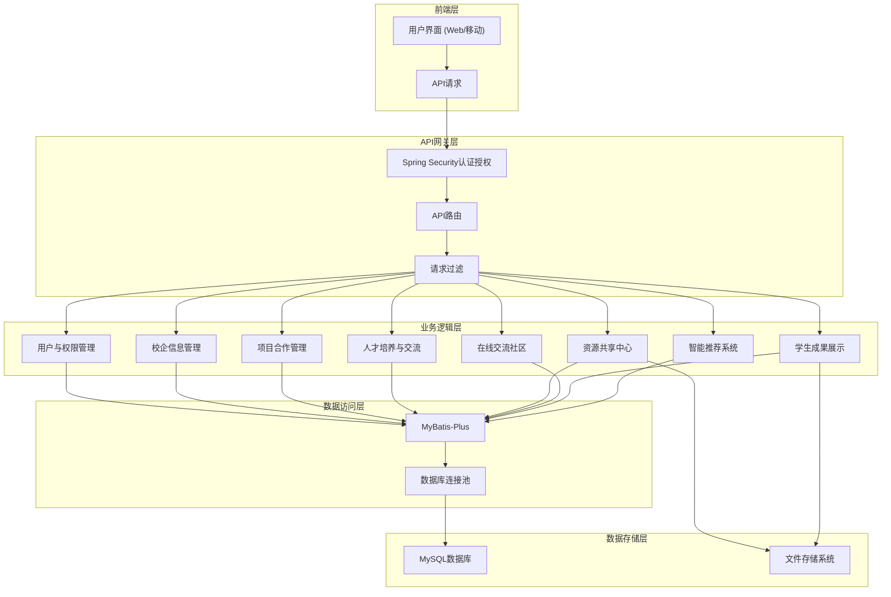
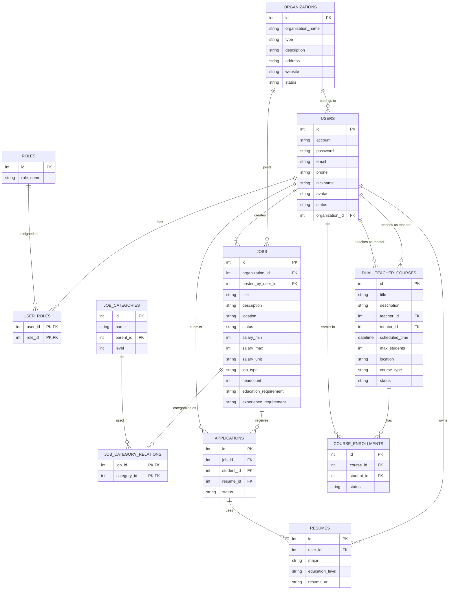

# 校企联盟平台系统架构图

## 系统架构图

```mermaid
graph TD
    subgraph "前端层"
        A1["用户界面 (Web/移动)"]
        A2["API请求"]
    end
    
    subgraph "API网关层"
        B1["Spring Security认证授权"]
        B2["API路由"]
        B3["请求过滤"]
    end
    
    subgraph "业务逻辑层"
        C1["用户与权限管理"]
        C2["校企信息管理"]
        C3["项目合作管理"]
        C4["人才培养与交流"]
        C5["资源共享中心"]
        C6["在线交流社区"]
        C7["学生成果展示"]
        C8["智能推荐系统"]
    end
    
    subgraph "数据访问层"
        D1["MyBatis-Plus"]
        D2["数据库连接池"]
    end
    
    subgraph "数据存储层"
        E1["MySQL数据库"]
        E2["文件存储系统"]
    end
    
    A1 --> A2
    A2 --> B1
    B1 --> B2
    B2 --> B3
    B3 --> C1
    B3 --> C2
    B3 --> C3
    B3 --> C4
    B3 --> C5
    B3 --> C6
    B3 --> C7
    B3 --> C8
    C1 --> D1
    C2 --> D1
    C3 --> D1
    C4 --> D1
    C5 --> D1
    C6 --> D1
    C7 --> D1
    C8 --> D1
    D1 --> D2
    D2 --> E1
    C5 --> E2
    C7 --> E2
```

## 数据库ER图

```mermaid
erDiagram
    USERS {
        int id PK
        string account
        string password
        string email
        string phone
        string nickname
        string avatar
        string status
        int organization_id FK
    }
    
    ORGANIZATIONS {
        int id PK
        string organization_name
        string type
        string description
        string address
        string website
        string status
    }
    
    ROLES {
        int id PK
        string role_name
    }
    
    USER_ROLES {
        int user_id PK,FK
        int role_id PK,FK
    }
    
    JOBS {
        int id PK
        int organization_id FK
        int posted_by_user_id FK
        string title
        string description
        string location
        string status
        int salary_min
        int salary_max
        string salary_unit
        string job_type
        int headcount
        string education_requirement
        string experience_requirement
    }
    
    JOB_CATEGORIES {
        int id PK
        string name
        int parent_id FK
        int level
    }
    
    JOB_CATEGORY_RELATIONS {
        int job_id PK,FK
        int category_id PK,FK
    }
    
    APPLICATIONS {
        int id PK
        int job_id FK
        int student_id FK
        int resume_id FK
        string status
    }
    
    RESUMES {
        int id PK
        int user_id FK
        string major
        string education_level
        string resume_url
    }
    
    DUAL_TEACHER_COURSES {
        int id PK
        string title
        string description
        int teacher_id FK
        int mentor_id FK
        datetime scheduled_time
        int max_students
        string location
        string course_type
        string status
    }
    
    COURSE_ENROLLMENTS {
        int id PK
        int course_id FK
        int student_id FK
        string status
    }
    
    USERS ||--o{ USER_ROLES : "has"
    ROLES ||--o{ USER_ROLES : "assigned to"
    ORGANIZATIONS ||--o{ USERS : "belongs to"
    ORGANIZATIONS ||--o{ JOBS : "posts"
    USERS ||--o{ JOBS : "creates"
    JOBS ||--o{ JOB_CATEGORY_RELATIONS : "categorized as"
    JOB_CATEGORIES ||--o{ JOB_CATEGORY_RELATIONS : "used in"
    JOBS ||--o{ APPLICATIONS : "receives"
    USERS ||--o{ APPLICATIONS : "submits"
    USERS ||--o{ RESUMES : "owns"
    APPLICATIONS ||--o{ RESUMES : "uses"
    USERS ||--o{ DUAL_TEACHER_COURSES : "teaches as teacher"
    USERS ||--o{ DUAL_TEACHER_COURSES : "teaches as mentor"
    DUAL_TEACHER_COURSES ||--o{ COURSE_ENROLLMENTS : "has"
    USERS ||--o{ COURSE_ENROLLMENTS : "enrolls in"
``` 